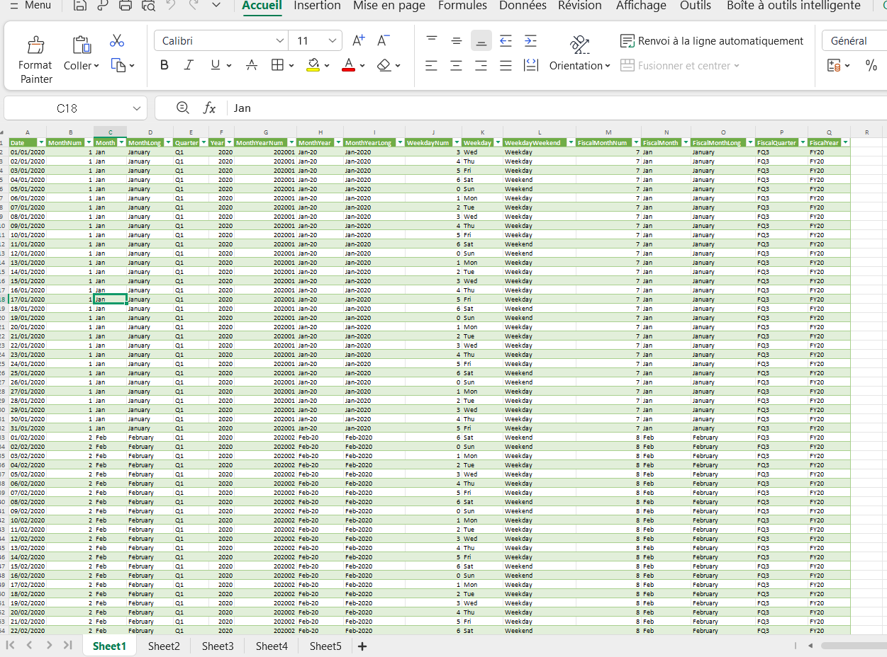
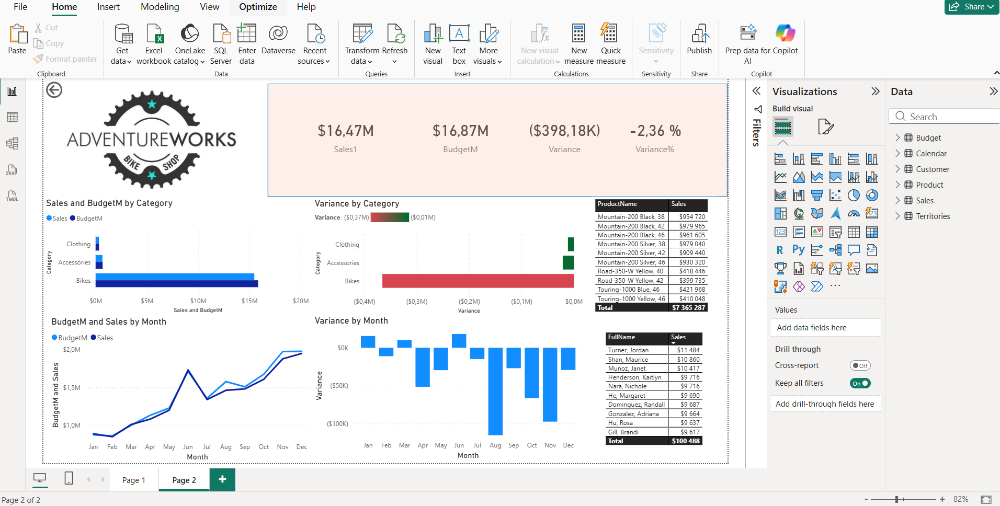

# 📊 AdventureWorks Sales & Budget Analysis – Power BI

## 🔍 Project Overview
This project demonstrates an end-to-end **Power BI Business Intelligence workflow** using **Excel-based data** as the source.

The data was **loaded from Excel files**, **cleaned and transformed using Power Query**, and then **manually modeled by creating relationships between tables** to ensure accurate analysis.

The final Power BI dashboard analyzes **sales performance versus budget** for AdventureWorks, enabling stakeholders to:
- Track overall sales and budget performance
- Identify category-level and monthly variances
- Analyze trends over time
- Support data-driven business decisions using interactive visuals and KPIs

---
## 🗂 Dataset Description
This project uses **two Excel files** as the data source:

- **Excel sheet named [Budget](Budget.xlsx)**
  Contains budget allocation data by product category and month (as shown in the uploaded dataset screenshot).

- **Excel sheet named [AdventureWorks_Database](AdventureWorks_Database.xlsx)**
  Contains detailed sales transaction data. All sales-related metrics and insights in the dashboard are derived from this file.

### Dataset Details
- **Source:** Excel files (AdventureWorks_Database & Budget)
- **Time Period:** January 2023 – December 2023
- **Granularity:** Monthly sales and budget data
- **Categories:** Bikes, Accessories, Clothing
- **Metrics:** Sales Amount, Budget Amount

The data from both Excel files was loaded into Power BI, cleaned and transformed using **Power Query**, and then combined through **manually created relationships** to support accurate sales vs budget analysis.

- **Screenshots of the Excel sheets [Budget](Budget.xlsx) which the Budget data was taken**

  
- **Screenshots of the Excel sheets  [AdventureWorks_Database](AdventureWorks_Database.xlsx) which the Sales/Customer/Product data was taken**

  
  
---

## 🛠 Tools & Technologies
- Power BI Desktop  
- Power Query (data transformation and cleaning)  
- DAX (calculated measures and KPIs)  
- Microsoft Excel  
- GitHub  

---

## 📐 Data Modeling & Transformations
- Cleaned and standardized category and product fields
- Transformed wide-format monthly data into an analytical model
- Created relationships between fact and dimension tables
- Ensured data accuracy for time-based and category analysis

---

## 📈 Key KPIs & DAX Measures
- Total Sales  
- Total Budget  
- Variance (Sales – Budget)  
- Variance %  
- Sales by Category  
- Monthly Sales Trend  

These KPIs provide both high-level summaries and detailed insights.

---

## 📥 Download Power BI Report
 1. Download the Power BI report:
 [Download Power BI Report (Project.pbix)](Project.pbix)
2. Open the file using Power BI Desktop
3. Refresh data if required

## 🖥 Dashboard Preview 

#### Screenshot of the Power Bi Dashboard

---
## Visualization & Reporting

- Built interactive Power BI dashboards with:

- KPI cards for executive summaries

- Category-level variance analysis

- Monthly trend and variance visuals

- Enabled stakeholders to quickly identify performance gaps and opportunities

---

## Analytical Findings
**Category Performance Analysis**

- **Bikes** account for the majority of revenue but show the largest negative variance, indicating a gap between actual performance and budget expectations.
- **Accessories** demonstrate stable sales with minimal variance, providing predictable revenue streams.
- **Clothing** contributes lower revenue but maintains consistent performance throughout the year.

➡️ Insight: Revenue is highly concentrated in Bikes, increasing financial risk and variance exposure.

---

## Time-Based & Trend Analysis

- Identified strong seasonality, with peak sales in *Q4 (Oct–Dec)*.

- Detected mid-year underperformance, particularly in August, contributing significantly to negative annual variance.

➡️ Insight: Static annual budgets do not fully align with seasonal demand patterns.

---
## Skills Demonstrated (Power BI / Data Analyst)

- Data extraction from Excel

- Data cleaning and transformation (Power Query)

- Data modeling and relationship management

- DAX measure creation

## Business and financial analysis
### Business Conclusion

The analysis highlights strong overall demand with minor budget shortfalls driven by category concentration and seasonal misalignment. By improving forecasting accuracy and leveraging Power BI insights, the business can better align budgets with demand and enhance decision-making.

